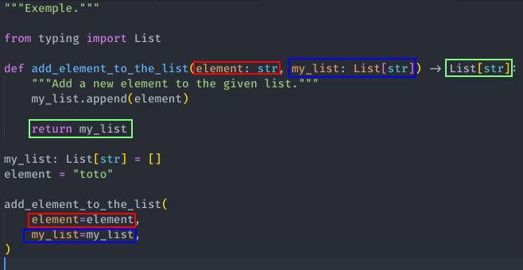

# OUTILS

- [OUTILS](#outils)
  - [NOTES IMPORTANTES](#notes-importantes)
  - [Black](#black)
  - [Pylint](#pylint)
  - [Flake8](#flake8)
  - [MyPy](#mypy)
  - [Pytest](#pytest)
  - [Isort](#isort)
  - [Pre-Commit](#pre-commit)

## NOTES IMPORTANTES

Si vous utilisez Poetry par exemple, toute sa configuration se situe dans *pyproject.toml*.

Dans ce cas, vous pouvez aussi centraliser la configuration de vos outils dans pyproject.toml

Exemple

```bash
[tool.isort]
profile = "black"
force_single_line = false
atomic = false
include_trailing_comma = true
lines_after_imports = 2
lines_between_types = 1
use_parentheses = true
filter_files = true
known_first_party = "poetry"


[tool.black]
line-length = 120
target-version = ["py37", "py38", "py39"]


[tool.semantic_release]
version_toml = [
    "pyproject.toml:tool.poetry.version"
]
branch = "master"
upload_to_pypi = false
upload_to_release = true
build_command = "poetry build"


[tool.mypy]
ignore_missing_imports = true


[tool.pylint.messages_control]
max-line-length = 120
extension-pkg-whitelist = "pydantic"

disable = [
    "too-few-public-methods",
    "broad-except",
    "duplicate-code",
    "too-many-arguments",
]
```

## Black

[Black](https://github.com/psf/black) est le formateur de code Python sans compromis.

En l'utilisant, vous acceptez de céder le contrôle sur les détails du formatage manuel.

En retour, Black vous offre vitesse, déterminisme et liberté du style de code basé sur PyCodeStyle.

Vous gagnerez du temps et de l'énergie mentale pour des questions plus importantes.

```bash
python -m black  --line-length 120 --check <code_folder>
```

## Pylint

[Pylint](https://pylint.pycqa.org/en/latest/index.html) est un outil d'analyse de code statique Python qui recherche les erreurs de programmation, aide à appliquer une norme de codage, détecte les erreurs de styles et propose des suggestions de refactorisation simples, le tout basé sur PEP8.

```bash
python3 -m pylint -vv <code_folder>
```

## Flake8

[Flake8](https://github.com/pycqa/flake8) est un outil incorporant les bonnes pratiques de *PyCodeStyle*, *PyFlakes* et *McCabe*.

```bash
python3 -m flake8 --max-line-length=120 --max-doc-length=120 <code_folder>
```

## MyPy

[MyPy](https://mypy.readthedocs.io/en/stable/) est un vérificateur de type statique pour Python.

Il vérifie notamment que les appels à une fonction, que le code de la fonction et que le type de retour déclaré sur une fonction concordent.



```bash
python3 -m mypy --install-types --non-interactive <code_folder>
```

MyPy dispose aussi d'un mode *strict* incluant plus de tests (bonus).

```bash
python3 -m mypy --install-types --non-interactive --strict <folder_code>
```

## Pytest

[Pytest](https://docs.pytest.org/en/6.2.x/) est un outil de test Python mature et complet qui vous aide à écrire de meilleurs programmes.

- Lancement de tous les tests

```bash
python3 -m pytest -vv -s
```

- Lancement d'un test spécifique

```bash
python3 -m pytest -vv -s -k <nom_du_test>
```

- Lancement d'un test et vérification de la couverture du code

```bash
python3 -m pytest -vv -s --cov=<code_folder>

python3 -m pytest -vv -s --cov=<code_folder> --cov-report=html
```

## Isort

[Isort](https://github.com/PyCQA/isort) permet de trier les importations par ordre alphabétique et de les séparer automatiquement en sections et par type.

## Pre-Commit

[Pre-Commit](https://pre-commit.com/) permet d'exécuter des scripts juste avec la validation du commit.

Les scripts de hook Git sont utiles pour identifier des problèmes simples avant de les soumettre à la revue de code. Nous exécutons nos hooks sur chaque commit pour signaler automatiquement les problèmes dans le code tels que les points-virgules manquants, les espaces de fin et les instructions de débogage.

En signalant ces problèmes avant la révision du code, cela permet à un réviseur de code de se concentrer sur l'architecture d'un changement tout en ne perdant pas de temps avec des pinailles de style trivial.

Exemple de configuration de pre-commit

```bash
# See https://pre-commit.com for more information
# See https://pre-commit.com/hooks.html for more hooks
repos:
  - repo: https://github.com/pre-commit/pre-commit-hooks
    rev: v4.0.1
    hooks:
      - id: trailing-whitespace
      - id: end-of-file-fixer
      - id: check-yaml
      - id: check-added-large-files

  # python code formatting - will amend files
  - repo: https://github.com/psf/black
    rev: 21.11b1 # https://github.com/psf/black/tags
    hooks:
      - id: black
        args: ["--line-length", "120"]

  # python import sorting - will amend files
  - repo: https://github.com/pycqa/isort
    rev: 5.10.1
    hooks:
      - id: isort
        additional_dependencies: [toml]

  # Flake8 includes pyflakes, pycodestyle, mccabe, pydocstyle, bandit
  - repo: https://gitlab.com/pycqa/flake8
    rev: 3.9.2
    hooks:
      - id: flake8
        additional_dependencies: ["flake8-docstrings"]
        exclude: ^tests|migrations
        args: ["--max-line-length", "120"]

  # Pylint
  - repo: https://github.com/pycqa/pylint
    rev: pylint-2.6.0
    hooks:
      - id: pylint

  # python static type checking
  - repo: https://github.com/pre-commit/mirrors-mypy
    rev: v0.910
    hooks:
      - id: mypy
        args:
          - --install-types
          - --non-interactive
        exclude: ^tests

default_language_version:
  python: python3.8
```

Pour installer pre-commit (Git doit être initier dans le projet)

```bash
poetry run pre-commit run --install
```

Pour lancer les checks sans faire de commits

```bash
poetry run pre-commit run --all-files
```

Exemple de sortie de pre-commit au moment d'un commit

```bash
▶ git commit -m "fix: Add pylint to precommit"
[INFO] Initializing environment for https://github.com/pycqa/pylint.
[INFO] Installing environment for https://github.com/pycqa/pylint.
[INFO] Once installed this environment will be reused.
[INFO] This may take a few minutes...
Trim Trailing Whitespace.................................................Passed
Fix End of Files.........................................................Passed
Check Yaml...............................................................Passed
Check for added large files..............................................Passed
black................................................(no files to check)Skipped
isort................................................(no files to check)Skipped
flake8...............................................(no files to check)Skipped
pylint...............................................(no files to check)Skipped
mypy.................................................(no files to check)Skipped
[main da674ce] fix: Add pylint to precommit
 1 file changed, 6 insertions(+)
```
